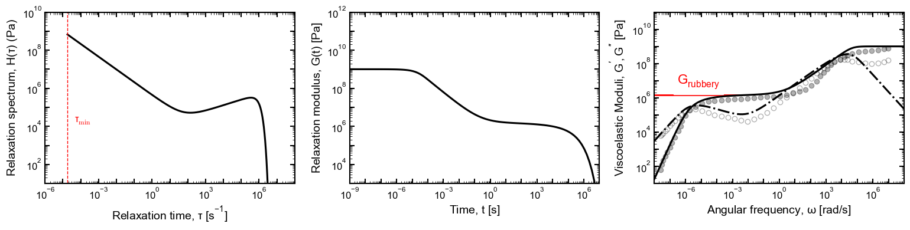

# **mBSW model data for the Rheology Textbook** 
*Created: Jan 31, 2025*

This Jupyter Notebook (`mBSW_data_generation.ipynb`) computes the relaxation modulus and dynamic moduli from a given set of mBSW parameters and saves it to `.csv` files in the `output_data/` folder

## Summary

- Data used here from the Hatzikiriakos et al. (2000) is for “PB-linear”, a well-entangled linear 1,4 polybutadiene, 
  > Hatzikiriakos, Savvas & Kapnistos, Michael & Chevillard, Cyril & Winter, H. & Roovers, Jacques. (2000). Relaxation time spectra of star polymers. Rheologica Acta. 39. 38-43. 10.1007/s003970050005.

  

    <table>
      <tr>
        <td></td>
        <td></td>
      </tr>
    </table>
  

- The inferred parameters from the paper corresponding to our standard mBSW form are,

  $$H(\tau) = e^{-\left(\frac{\tau}{\tau_{\max}}\right)^\beta} 
  \left[ H_e \left( \frac{\tau}{\tau_{\max}} \right)^{n_e} + 
  H_g \left( \frac{\tau}{\tau_e} \right)^{-n_g} \right]$$

  

  | **Variable**    | **Value**          |
  |---------------|------------------|
  | $H_g$ (Pa)   | $4.9 \times 10^5$ |
  | $n_g$         | $0.67$            |
  | $\tau_e$ (s)  | $0.86$            |
  | $H_e$ (Pa)   | $1.86 \times 10^5$ |
  | $n_e$         | $0.30$            |
  | $\tau_{\max}$ (s) | $9.0 \times 10^5$ |
  | $\beta$       | $2.0$ 

  

- A free parameter not mentioned is the minimum cutoff relaxation time $(\tau_{\text{min}})$. We used it to match the glassy modulus, giving us,
  - $\tau_{\text{min}} = 1.8\times 10^{-5}~\text{s}$
  - Calculated rubbery modulus, $G_{\text{rubbery}} = 1.42~\text{MPa}$
- Additional analysis performed for improved model fitting and uncertainty quantification. Details in `additional_analysis/`

  

## Contributing

Feel free to modify the notebook for different datasets or additional processing steps. Please contact asm[eighteen][at]illinois.edu for any feedback.

## License

This project is open-source and licensed under the MIT License.

[def]: image.png
